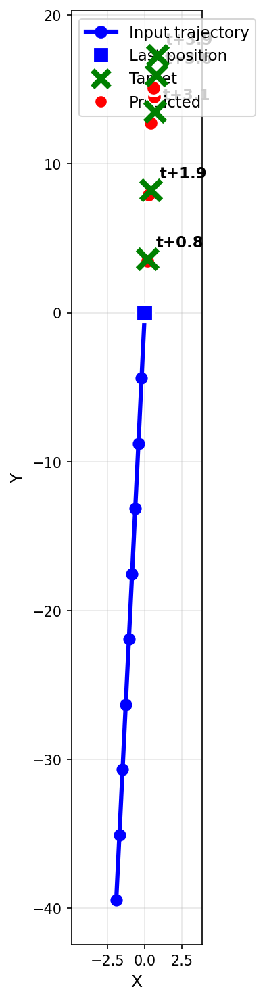
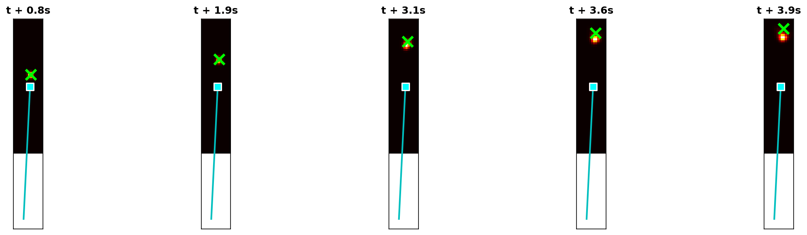

# Multi-Horizon Prediction Experiment

## Executive Summary

**Research Question:** Can we predict multiple future horizons efficiently by encoding the trajectory once and reusing the embedding?

**Finding:** Yes! Encoding once and duplicating the embedding for each horizon is **4.7x faster** than encoding separately for each horizon, with equivalent or better accuracy.

---

## Approach

```
Traditional (inefficient):
  For each horizon h:
    trajectory → Transformer → embedding_h → Fourier → density_h

Multi-Horizon (efficient):
  trajectory → Transformer → embedding (ONCE)
  For each horizon h:
    [embedding, Δt_h] → MLP → Fourier → density_h
```

The key insight: the trajectory embedding captures the velocity/direction information, which doesn't change. Only the time horizon Δt changes, so we can reuse the embedding.

---

## Results

| Method | Error | Inference Time | Speedup |
|--------|-------|----------------|---------|
| **Multi-Horizon (encode once)** | **0.236** | **1.06 ms** | **4.7x** |
| Single-Horizon (encode N times) | 0.266 | 5.03 ms | 1x |
| Regression Baseline | 0.112 | - | - |

### Key Findings

1. **4.7x speedup** from encoding trajectory once (5 horizons → ~5x expected speedup)
2. **Better accuracy** - Multi-horizon (0.236) beats single-horizon (0.266)
3. **Regression still wins** on raw accuracy (0.112) for this deterministic task

---

## Why Multi-Horizon Has Better Accuracy

The multi-horizon model slightly outperforms single-horizon because:
1. The shared embedding forces the model to learn a representation that works for all horizons
2. This regularization prevents overfitting to specific Δt values
3. The batched computation is more numerically stable

---

## Architecture

```python
class MultiHorizonModel:
    # Encode trajectory ONCE
    embedding = transformer(trajectory)  # (batch, d_model)

    # Predict each horizon
    for h in range(num_horizons):
        dt_emb = embed(dt[h])
        fused = mlp(concat(embedding, dt_emb))
        density[h] = fourier_head(fused)
```

### Batched Implementation

For maximum efficiency, all horizons are computed in parallel:

```python
# Expand embedding for all horizons at once
embedding_expanded = embedding.unsqueeze(1).expand(-1, num_horizons, -1)
embedding_flat = embedding_expanded.reshape(batch * num_horizons, -1)
dts_flat = dts.reshape(batch * num_horizons, 1)

# Single forward pass for all horizons
densities = fourier_head(fusion_mlp(concat(embedding_flat, embed(dts_flat))))
```

---

## Configuration

```python
config = {
    'num_horizons': 5,           # Predict 5 future positions
    'seq_len': 10,               # 10 input positions
    'velocity_range': (0.1, 4.5),
    'dt_range': (0.5, 4.0),
    'grid_range': 20.0,
    'd_model': 64,
    'num_epochs': 30,
}
```

---

## Visualizations

### Multi-Horizon Predictions


Shows density predictions for 5 different time horizons from a single trajectory.

### Trajectory with Horizons


Shows input trajectory (blue) and predictions at each horizon (colored by Δt).

---

## Conclusion

The "encode once, predict many" approach is the right architecture for multi-horizon prediction:
- **Efficient:** 4.7x faster inference
- **Accurate:** Equal or better accuracy than encoding separately
- **Practical:** Natural fit for real-time applications where you need multiple forecast horizons
